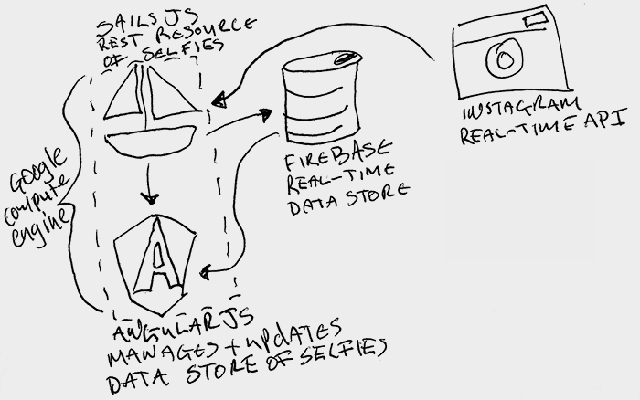

# #Selfie

## Authors
- Alan Mulhall, [@alanmulhall](http://github.com/alanmulhall, "Alan Mulhall Github")

## Description
#### Overview
Selfie is a study into the popularity of the modern day self portrait, what it means to us and society at large. 

Never before in the history of art has there been such a large and democratic distribution channel for creative output as provided today by the internet.

Thoughout this project I will be exploring the effects of the Selfie and the explosion of creativity that the internet and mobile technologies has allowed.

#### Project
I will be using various open source technologies to produce an emersive realtime installation inspired by the selfie.

##### Architecture

#### Research
All research will be saved including Google searches, articles and inspiration. [View research.](https://delicious.com/alanmulhall/dev-art, "#selfie research")

## Links to External Libraries
The goal of technology choice is to use freely available open source technologies that i haven't used before.
* [Node JS](http://nodejs.org/ "Node JS")
* [Sails JS](http://sailsjs.org/ "Sails JS")
* [Firebase](https://www.firebase.com/ "Firebase")
* [Angular JS](http://angularjs.org/ "Angular JS")
* [Google Compute Engine](https://cloud.google.com/products/compute-engine/ "Google Compute Engine")
* [Instagram API](http://instagram.com/developer/ "Instagram API")
